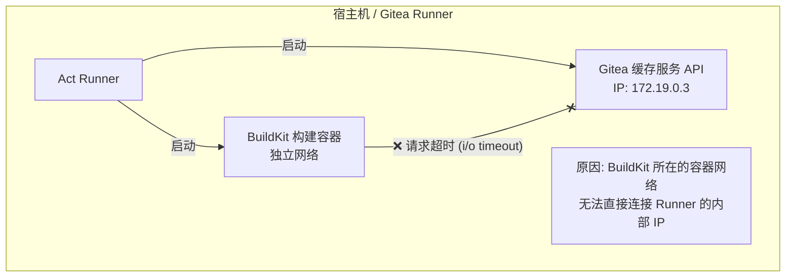
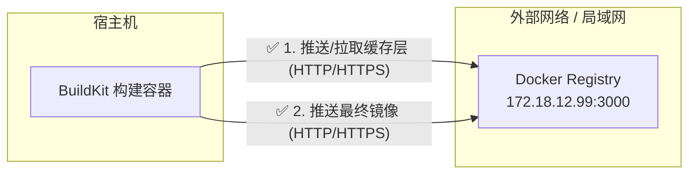

[[NPM（包管理器）]]查看已安装的全局包：`npm list -g --depth=0`
[[NPM（包管理器）]] 查看需要更新的全局包：`npm outdated -g`
[[NPM（包管理器）]] 更新所有全局包：`npm update -g`

---

[[NPM（包管理器）]] 所需的[[环境变量]]

```bash
export NODE_HOME=path/to/node
export PATH=path/to/node/bin:$PATH
```

---

[[SSH]] 直接执行命令：`ssh username@remote_server_ip "ls -l /tmp"`

---

要定义 [[SSH]] 链接别名以方便链接，只需在 `~/.ssh/conig` 中添加如下内容：

```txt
Host myserver
    HostName remote_server_ip
    User username
    Port 22
```

之后使用 `ssh myserver` 即等效于 `ssh -p 22 username@remote_server_ip`

---

[[SSH]] 的[[文件权限]]限制很严格，需要确保满足以下条件：

```bash
chmod 700 ~/.ssh
chmod 600 ~/.ssh/authorized_keys
```

---

查看 [[SSH]] 登录日志：

- Debian 系：`tail -f /var/log/auth.log`
- RHEL 系：`tail -f /var/log/secure`

---

[[SSH]] 测试模式：`ssh -vvv username@remote_server_ip`

---

要压缩 [[WSL]] 磁盘，可运行 `diskpart`，执行以下命令：

```bash
SELECT VDISK FILE="path/to/wsl/vdisk/ext4.vhdx"
COMPACT VDISK
DETACH VDISK
EXIT
```

---

[[GitHub]] 设置多仓库远程推送

**同时推送：**

如果希望一次 `git push` 同时推送到多个仓库，可以将它们添加到同一远程仓库名，如下：

```bash
git remote set-url --add --push origin $remote_repo_1
git remote set-url --add --push origin $remote_repo_2
```

> 如果误操作，可使用 `git remote set-url --delete --push origin $url` 移除

验证配置

```bash
git remote -v
```

推送

```bash
git branch -M main
git push -u origin main
```

**独立推送：**

如果希望按需选择推送到 GitHub 或 Gitea，而不是每次都捆绑推送，可以为它们分别设置不同的远程仓库别名，添加独立的远程仓库，如下：

```bash
# 添加 GitHub 仓库，命名为 github
git remote add github git@github.com:name/repo.git

# 添加 Gitea 仓库，命名为 gitea
git remote add gitea ssh://git@host:port/name/repo.git
```

> 如果之前已经存在名为 origin 的仓库，你想把它改名以便区分，可以使用 `git remote rename $old_name $new_name`。要删除某个不需要的别名，可以使用 `git remote remove $name`。

验证配置

```bash
git remote -v
```

在推送时，只需显式指定对应的远程仓库别名即可实现按需推送：

```bash
# 仅推送到 GitHub
git push github main

# 仅推送到 Gitea
git push gitea main
```

---

[[GitHub]] 关联到非空远程仓库

**关联远程库：**

```bash
# 关联远程库
git remote add origin "https://github.com/HiroMuraki/g1_urp"

# 设置上游分支
git push --set-upstream origin main
```

**处理分叉：**

```bash
## 方式1（推荐用于大型团队）：使用merge策略（保留所有提交历史）
## 将远程更改与本地更改合并，并自动生成一个新的 "Merge commit"
## 完整保留历史操作的原始时间线
git config pull.rebase false
git pull --no-rebase

## 方式2（推荐个人项目）：使用rebase策略（重写本地提交历史）
## 把你的本地提交先“摘下来”，把远程的新提交接上，再把你的提交按顺序“贴”在远程提交之后
## 优点: 提交历史会变成一条直线，非常整洁，没有杂乱的合并记录。
git config pull.rebase true
git pull --rebase

## 方式3：只允许快进合并（如果存在分叉则拒绝）
## 只有当本地没有任何新提交、可以直接“顺着跑”到远程进度时才允许成功
## 极其保守，防止不小心污染了历史记录。如果存在分叉，Git 会直接报错提醒你手动干预
git config pull.ff only
git pull --ff-only
```

**强制合并独立历史：**

```bash
git pull origin main --allow-unrelated-histories
```

> 需要此命令通常发生在：
>
> 1. 你先在本地初始化了一个仓库并写了代码。
> 2. 你又在 GitHub 上创建了一个带 README 的仓库。
> 3. 当你尝试合并时，Git 发现它们没有任何共同祖先（两个完全无关的项目）。
>
> 相当于强制告诉 Git：“我知道它们没关系，但请把它们合并在一起。”

**推送：**

```bash
git push
```

---

通用 [[GitHub Action]] 构建策略

- 善用 `Environments` 与 `Secrets`
- 善用 workflows 的短路运算，如下面声明可实现定义了 `vars.DOCKER_REGISTRY` 时则使用其值，否则使用 `ghcr.io`

```yaml
env:
    REGISTRY: ${{ vars.DOCKER_REGISTRY || 'ghcr.io'}}
```

- 对于 `docker/setup-buildx-action`，可考虑使用环境变量 + 默认值动态选取配置文件，如下

```yaml
- name: Set up Docker Buildx
  uses: docker/setup-buildx-action@v3
  with:
      buildkitd-config: ${{ env.BUILDKITD_CONFIG_FILE }}
```

- 避免使用 GitHub 专用 Action，如 `actions/delete-package-versions`

---

[[Docker]] 不会即时读取证书目录，因此执行 update-ca-certificates 后若要使其对 docker 生效，通常需要重启 docker。

如果需要证书即时生效，将证书放在路径 `/etc/docker/certs.d/your.host.name/ca.crt`

- your.host.name 为域名
- ca.crt 是固定名称，不可修改。

---

[[Linux]] 中可以使用 `openssl version -d` 查询系统级信任证书目录

---

使用 `nginx -T 2>/dev/null | grep -E "ssl_certificate\s"` 可查询 [[Nginx]] 的信任证书目录

---

若 [[BuildKit]] 与 [[Gitea]] 提供的缓存服务不在同一个网络频道，则当设定 Action `docker/build-push-action@v5` 的 `from-cache` 与 `cache-to` 为 `gha` 模式时，即如下：

```yaml
with:
    cache-from: type=gha
    cache-to: type=gha,mode=max
```

那么在构建时，可能遇到如下报错

```txt
ERROR: failed to build: failed to solve: DeadlineExceeded: Get "http://172.19.0.3:37833/_apis/artifactcache/cache?keys=buildkit-blob-1-sha256%3A098a7696206484c3661279565ff615cae9bf20173c9248162d3e20d5e0e96994&version=693bb7016429d80366022f036f84856888c9f13e00145f5f6f4dce303a38d6f2": dial tcp 172.19.0.3:37833: i/o timeout

::error::buildx failed with: ERROR: failed to build: failed to solve: DeadlineExceeded: Get "http://172.19.0.3:37833/_apis/artifactcache/cache?keys=buildkit-blob-1-sha256%253A098a7696206484c3661279565ff615cae9bf20173c9248162d3e20d5e0e96994&version=693bb7016429d80366022f036f84856888c9f13e00145f5f6f4dce303a38d6f2": dial tcp 172.19.0.3:37833: i/o timeout
```

**原因**：

此状网络状态如下：

- 缓存服务 (Artifact Cache)：Gitea Runner 启动了一个内部服务来模拟 GitHub Actions 的缓存 API，它的 IP 是 172.19.0.3（属于 Gitea Runner 创建的一个专用 Docker 网络）。

- 构建容器 (BuildKit)：当你运行 setup-buildx-action 时，它启动了一个全新、独立的 BuildKit 容器。这个容器默认连接到 Docker 的默认网桥，或者它自己的网络。

此时，错误发生：BuildKit 容器试图去连接 172.19.0.3:37833，但由于它不在 Gitea Runner 的那个专用网络里，它根本“看不见”这个 IP，或者被防火墙/路由规则拦截了，最终导致 i/o timeout。

**解决方案**：

方法一：将 Buildx 其加入到 Gitea 的网络

```yaml
uses: docker/setup-buildx-action@v3
with:
    driver-opts: |
        network=forgejo_net
```

方法二：改用 registry 缓存

```yaml
cache-from: type=registry,ref=${{ env.FULL_IMAGE_NAME }}:buildcache-amd64
cache-to: type=registry,ref=${{ env.FULL_IMAGE_NAME }}:buildcache-amd64,mode=max
```

**附加说明**：

**type=gha(GitHub Actions Cache)**：

GitHub Actions 专用的缓存后端。GitHub Actions 的 Runner（运行器）在运行时，会启动一个 内部的 HTTP 缓存服务器（Artifact Cache Service）。

- 存储位置：GitHub 的专用对象存储（Azure Blob Storage 等），但在 Runner 看来，它是一个本地的 HTTP API。

- 通信方式：BuildKit 容器通过 HTTP 请求，向 Runner 暴露的这个内部 API 发送缓存数据。

- 认证：通过环境变量 ACTIONS_RUNTIME_TOKEN 和 ACTIONS_CACHE_URL 自动完成。



**type=registry(Container Registry Cache)**：



基于 Docker 镜像仓库的通用缓存后端。它把缓存层（Cache Layers）伪装成 Docker 镜像，存储在你的镜像仓库（Harbor, GHCR, Docker Hub）里。

- 存储位置：和你最终的 Docker 镜像在同一个地方。

- 通信方式：标准的 HTTPS 推送/拉取。只要你的机器能 docker push，它就能通过。

- 结构：它会把缓存元数据和图层打成一个包，推送到你指定的 tag（例如 :buildcache）。这实际上是一个“幽灵镜像”，它包含了构建过程中的中间层。

---

对于 [[Gitea]]，若要使用 [[BuildKit]] CI 构建 [[Docker]] 镜像，可以考虑在 `docker/setup-buildx-action` 中将 buildx 的 network 模式配置为 `host`，这样 Buildx 可以直接通过 `127.0.0.1:3000` 访问宿主机的 Gitea 服务，避免很多麻烦。

```bash
uses: docker/setup-buildx-action@v3
with:
    driver-opts: network=host
```

这意味着在推送到本地 Gitea 时，本地仓库的地址可以硬编码为 `127.0.0.1:3000`，对于单机部署的维护比较友好。

---

[[Podman]] 导出正在运行的容器为 [[k8s]] yaml：`podman generate kube <容器名称或ID> > my-container.yaml`

---

[[Podman]] 导出镜像命令：`podman save --output nginx.tar nginx:latest`

[[Podman]] 导入镜像命令：

- `podman load --input nginx.tar`
- `cat nginx.tar | podman load`

---

[[Docker]] 与 [[Docker Compose]] 常用命令

**用户：**

- 将当前用户添加到 [[Docker]] 组：`usermod -aG docker $USER`

**镜像：**

- 查看本地 [[Docker]] 镜像：`docker images` 或 `docker image ps`
- 拉取 [[Docker]] 镜像：`docker pull $registry/repository:tag`
- 移除指定本地 [[Docker]] 镜像：`docker rmi $image_id_or_name` 或 `docker image remove $image_id_or_name`

**容器：**

- 通过镜像创建容器实例：`docker run $repository:tag`
- 停止容器：`docker container stop $container_id_or_name`
- 查看运行中的容器：`docker ps` 或 `docker container ls`
- 查看特定容器的日志输出：`docker container logs $container_id_or_name`
- 将后台运行的容器拉到前台：`docker attach $container_id_or_name`
- 将前台的运行容器 detach 到后台：按下 `Ctrl` + `P` 后再按下 `Q`
- 直接让容器执行特定命令：`docker exec $container_id_or_name $command`
- 清理已停止的容器：`docker container prune`
- 导出容器：`docker export $container_id_or_name > container.tar`
- 导入容器：`cat container.tar | docker import - container_name`

**卷：**

- 列出所有卷：`docker volume ls`
- 查看特定卷详情：`docker volume inspect $volume_name`
- 创建卷：`docker volume create $volume_name`
- 删除卷：`docker volume rm $volume_name`
- 删除所有未被引用的卷：`docker volume prune`

**容器编排：**

- 启动编排：`docker compose up`
- 停止服务：`docker compose down`

---

备份与恢复 [[Docker]] 卷的命令：

**备份：**

```bash
docker run --rm \
    --volumes-from <source_container> \
    -v $(pwd)/backups:/backup \
    alpine \
    tar czf /backup/backup_$(date +%Y%m%d_%H%M%S).tar.gz -C /path/to/backup .
```

工作流程

1. 创建基于 alpine 的临时容器，用后删除
2. 继承 `$source_container` 的所有挂载
3. 挂载本地备份目录到容器内的 /backup 目录
4. 将指定路径的目录打包到 /backup 备份目录

**恢复：**

```bash
docker run --rm \
    --volumes-from ollama \
    -v $(pwd)/backups:/backup \
    alpine \
    sh -c "rm -rf /path/to/backup/* && tar xzf /backup/backup.tar.gz -C /path/to/backup"
```

---

在 [[Docker]] 环境中使用 [[CUDA]]

**（1）在宿主机安装 NVIDIA Container Toolkit：**

Apt：

```bash
curl -fsSL https://nvidia.github.io/libnvidia-container/gpgkey \
    | sudo gpg --dearmor -o /usr/share/keyrings/nvidia-container-toolkit-keyring.gpg
curl -fsSL https://nvidia.github.io/libnvidia-container/stable/deb/nvidia-container-toolkit.list \
    | sed 's#deb https://#deb [signed-by=/usr/share/keyrings/nvidia-container-toolkit-keyring.gpg] https://#g' \
    | sudo tee /etc/apt/sources.list.d/nvidia-container-toolkit.list
sudo apt-get update
sudo apt-get install -y nvidia-container-toolkit
```

Yum/Dnf：

```bash
curl -fsSL https://nvidia.github.io/libnvidia-container/stable/rpm/nvidia-container-toolkit.repo \
    | sudo tee /etc/yum.repos.d/nvidia-container-toolkit.repo
sudo yum install -y nvidia-container-toolkit
```

**（2）在 `docker run` 中添加 `--gpus` 启动项**

---

限制 [[Docker Compose]] 特定容器可用的运行资源：

```yml
deploy:
    resources:
        limits:
            cpus: "1.0"
            memory: 512M
```
